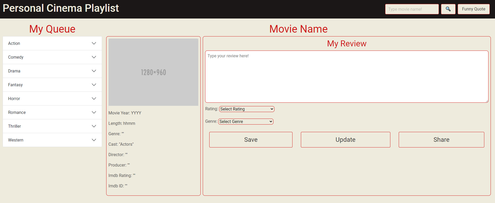

# movies-watchlist

1. Summary: Movie-Watchlist (Personal Cinema Playlist) is a web application that lets the users search for movies, add them to their queue, provide reviews and ratings, and share their reviews on Facebook.

2. Features:
    * Search Movies:
        - The user can search for a movie simply by Providing words in the name of the movie.
        - The app will search the http://www.omdbapi.com/ database through their search API and return the movie names that match the search criteria.
        - The movies will be displayed in a modal. The user can select the movie that they are looking for by clicking on any of the movie names.
        - After a movie name is selected, the basic information of the movie (poster, year, length, genre, cast, director, Producer, IMDb Rating, and IMDb ID) will be rendered on the main area of the page.

    * Review Section:
        - For new movies, the user can:
            - Save the movie to their queue by clicking on the save button.
            - Provide a review and rating if they have watched the movie. These fields are optional and can be updated at any time after saving the movie.
            - Select the genre of the movie. This field is required to save the movie into the queue, as it will indicate under what category the movie will be saved in the My Queue section.
        - Update Review and Rating:
            - To update the review and rating of a saved movie, locate the movie on the My Queue section and click on it to render the saved information in the main area of the page.
            - After the information is displayed, the user can edit the review and change the rating.
            - The genre of the movie cannot be changed once a movie has been saved. The field will display the genre selected when the movie was saved, but the user won't be able to change its value.
                - To change the genre, the user will have to delete the movie from their queue by clicking on the delete button on the right side of the movie name. Search and save the film again.
        - Share Review:
            - The user can share the poster of the movie and their review to Facebook by clicking on the share button.
      * Responsive Site:
        - The page was built to be rendered on any mobile device.

3. Image:

